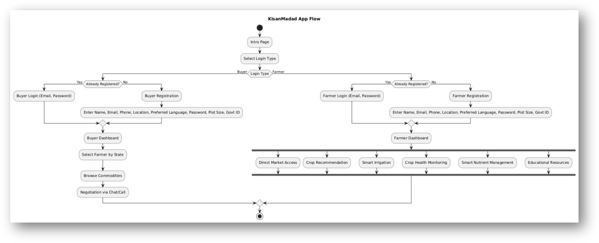

# KisanMadad

**Team ID**: A0237  
**Team Name**: VIT-US

KisanMadad is an innovative platform designed to empower farmers by leveraging **AI**, **IoT**, and **drones**. It provides solutions for direct market access, smart irrigation, crop health monitoring, and educational resources, all with the aim of increasing productivity and profitability for farmers.

---

## Features

- **Direct Market Access**: Enables direct transactions between farmers and buyers, ensuring fair pricing by eliminating intermediaries.
- **AI-Driven Crop Recommendation**: Provides suggestions based on soil and weather data to help farmers choose the best crops for their land.
- **Smart Irrigation**: Uses IoT sensors to monitor soil moisture and weather conditions, optimizing water usage.
- **Crop Health Monitoring**:
  - **Drone Monitoring**: Detects early crop issues using drones equipped with AI for actionable solutions.
  - **Crop Health Check**: Evaluates soil suitability based on Nitrogen (N), Phosphorus (P), and Potassium (K) values.
- **Smart Nutrient Management**: Provides personalized fertilizer recommendations based on soil conditions.
- **Educational Resources**: Localized farming tutorials integrated via YouTube, offering farmers access to important knowledge.

---

## Problem Addressed

KisanMadad addresses the inefficiencies in traditional farming practices by improving resource management, enhancing crop health, and increasing farmer profitability through direct access to markets. The platform reduces reliance on intermediaries and promotes sustainable farming.

---

## Technologies Used

- **Frontend**: XML, Java (Android)
- **Backend**: Firebase API, Flask API, YouTube API, Government Database API
- **AI/ML**: Artificial Neural Networks, ResNet, TensorFlow Lite
- **Database**: Firebase
- **Hardware**:
  - IoT Sensors (soil moisture, weather, and soil nutrient sensors)
  - Drones equipped with cameras for crop monitoring

---

## Architecture

KisanMadad integrates Intel's AI and oneAPI toolkits to create a seamless, high-performance system that runs on Intel® CPUs and GPUs, offering scalable and efficient agricultural solutions.

---

## Implementation

1. **Platform Development**: Modular design using Java and XML, with real-time data integration from sensors and drones.
2. **AI Integration**: Leveraging TensorFlow, PyTorch, Keras, CNN, and OpenCV for disease detection, irrigation scheduling, and market analytics.
3. **Pilot Testing**: Conducted pilot projects to gather feedback and refine the platform.
4. **Scaling**: Plans to partner with agricultural organizations to drive adoption.

---

## Feasibility and Challenges

**Feasibility**: KisanMadad’s integration of AI, IoT, and drones makes it scalable and adaptable to solve key agricultural challenges.

**Challenges**:
- Low digital literacy among farmers.
- High initial costs for IoT sensors and drones.
- Connectivity issues in rural areas.

**Strategies**:
- Training programs for farmers.
- Partnerships and subsidies to reduce costs.
- Offline functionality to mitigate connectivity challenges.

---

## Impact

- **Social**: Promotes fair pricing and market access, reducing economic disparity, and helps farmers adopt modern technology.
- **Economic**: Increases farmer incomes by connecting them directly to buyers and reducing input costs.
- **Environmental**: Supports sustainable farming through optimized resource usage and minimized chemical inputs.

---

## Contact

For any queries or contributions, feel free to reach out to our team.

---
